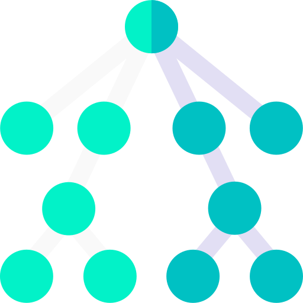

  

<h1 align="center">LeetCode Solutions</h1>

## Table of contents

- [Table of contents](#table-of-contents)
- [About](#about)
- [Links](#links)
- [License](#license)

## About

This repository contains my solutions to various LeetCode problems of different levels. Made with JavaScript, Python, TypeScript and whatever else I would decide to use for DSA.

## Links

- [LeetCode](https://leetcode.com/problemset/all/)
- [Logo](https://www.flaticon.com/)

## License

This project is licensed under the [MIT License](./LICENSE).

<a href="#readme-top"><strong>Back to top</strong></a>

